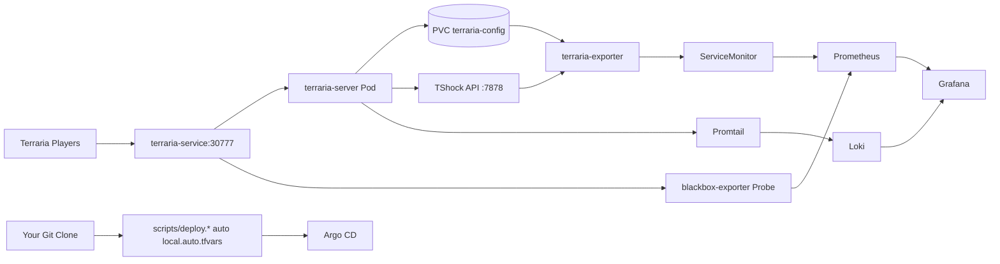
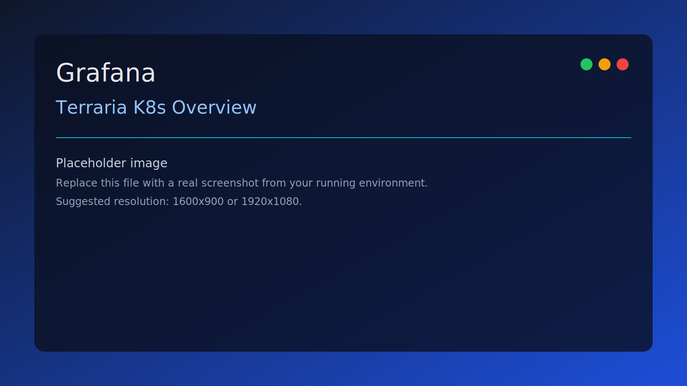
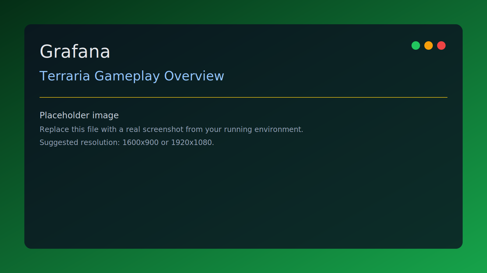
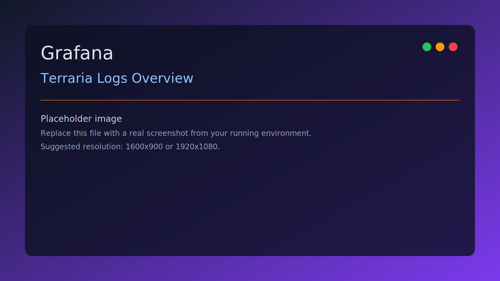
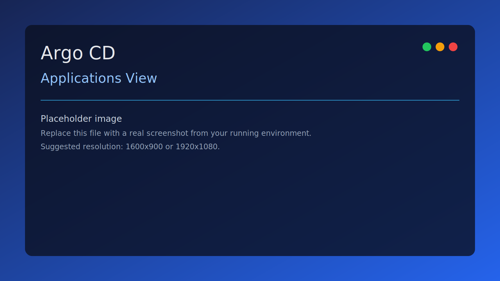
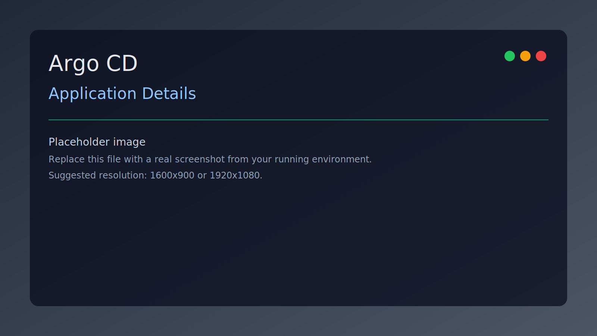

<p align="center">
  <a href="README.md"></a>
  <a href="README.pt-BR.md"></a>
</p>

<p align="center">
  
</p>

<p align="center">
  
</p>

<p align="center">
  
  
  
  
  
</p>

# terrariadosbobo

Production-style local stack for a Terraria server with observability, backups, and GitOps.

## Table of Contents

- [What this deploys](#what-this-deploys)
- [Architecture](#architecture)
- [Requirements](#requirements)
- [Quick Start](#quick-start)
- [Access URLs](#access-urls)
- [Cross-platform command matrix](#cross-platform-command-matrix)
- [Screenshots](#screenshots)
- [World management](#world-management)
- [Observability](#observability)
- [Argo CD](#argo-cd)
- [Terraform vs Argo CD](#terraform-vs-argo-cd)
- [Cloud deployment (AWS, GCP, OCI)](#cloud-deployment-aws-gcp-oci)
- [External world storage and backups](#external-world-storage-and-backups)
- [Repository structure](#repository-structure)
- [Troubleshooting](#troubleshooting)
- [Destroy](#destroy)

## What this deploys

| Layer | Components |
|---|---|
| Game | `terraria-server` (`ghcr.io/beardedio/terraria:tshock-latest`) + PVC `terraria-config` |
| Metrics | Prometheus Operator stack (`kube-prometheus-stack`), `kube-state-metrics`, node exporter |
| Gameplay metrics | Custom `terraria-exporter` (API + `.wld` parser fallback) |
| Availability checks | Blackbox exporter + Prometheus `Probe` for Terraria TCP |
| Dashboards | `Terraria K8s Overview`, `Terraria Gameplay Overview`, `Terraria Logs Overview` |
| Logs | Loki + Promtail |
| GitOps | Argo CD + optional auto-bootstrap Application |
| Data safety | World backup CronJob + backup PVC |

## Architecture



## Requirements

| Requirement | Notes |
|---|---|
| Docker Desktop + Kubernetes enabled | Local cluster (`docker-desktop` context) |
| `kubectl` | Must reach the cluster |
| `terraform` | Tested with Terraform 1.6+ |
| Git | Used for Argo auto-repo detection |
| Windows PowerShell or Linux/WSL Bash | Both are supported |

## Quick Start

### 1) Copy variables

```powershell
Copy-Item terraform/terraform.tfvars.example terraform/terraform.tfvars
```

```bash
cp terraform/terraform.tfvars.example terraform/terraform.tfvars
```

Edit at least:

- `world_file`
- `grafana_admin_password`

### 2) Optional environment variables

`deploy.ps1` and `deploy.sh` can auto-generate `terraform/local.auto.tfvars` (gitignored) from your current clone.

Argo CD repo values (optional):

- `ARGOCD_APP_REPO_URL`
- `ARGOCD_REPO_USERNAME`
- `ARGOCD_REPO_PASSWORD`
- `ARGOCD_REPO_SSH_PRIVATE_KEY`

Grafana GitHub OAuth values (optional):

- `GRAFANA_GITHUB_OAUTH_ENABLED`
- `GRAFANA_GITHUB_CLIENT_ID`
- `GRAFANA_GITHUB_CLIENT_SECRET`
- `GRAFANA_GITHUB_ALLOWED_ORGS` (comma-separated)

Example (PowerShell):

```powershell
$env:GRAFANA_GITHUB_OAUTH_ENABLED = "true"
$env:GRAFANA_GITHUB_CLIENT_ID = "your-client-id"
$env:GRAFANA_GITHUB_CLIENT_SECRET = "your-client-secret"
$env:GRAFANA_GITHUB_ALLOWED_ORGS = "your-org"
```

Example (Bash):

```bash
export GRAFANA_GITHUB_OAUTH_ENABLED=true
export GRAFANA_GITHUB_CLIENT_ID="your-client-id"
export GRAFANA_GITHUB_CLIENT_SECRET="your-client-secret"
export GRAFANA_GITHUB_ALLOWED_ORGS="your-org"
```

### 3) Deploy

Windows:

```powershell
./scripts/deploy.ps1
```

Linux / WSL:

```bash
bash ./scripts/deploy.sh
```

With first-world bootstrap options:

```powershell
./scripts/deploy.ps1 -WorldName "test.wld" -WorldSize large -MaxPlayers 16 -Difficulty expert -Seed "seed-123"
```

```bash
bash ./scripts/deploy.sh --world-name test.wld --world-size large --max-players 16 --difficulty expert --seed seed-123
```

## Access URLs

| Service | URL |
|---|---|
| Grafana | `http://localhost:30030` |
| Prometheus | `http://localhost:30090` |
| Argo CD | `http://localhost:30080` |
| World UI (Argo app) | `http://localhost:30878` |
| Terraria server | `YOUR_LAN_IP:30777` |

## Cross-platform command matrix

| Task | Windows (PowerShell) | Linux/WSL (Bash) |
|---|---|---|
| Deploy stack | `./scripts/deploy.ps1` | `bash ./scripts/deploy.sh` |
| Deploy with first-world options | `./scripts/deploy.ps1 -WorldName "test.wld" -WorldSize large -MaxPlayers 16 -Difficulty expert -Seed "seed-123"` | `bash ./scripts/deploy.sh --world-name test.wld --world-size large --max-players 16 --difficulty expert --seed seed-123` |
| Upload world file | `./scripts/upload-world.ps1 -WorldFile "C:/path/map.wld"` | `bash ./scripts/upload-world.sh --world-file /c/path/map.wld` |
| World creator + management UI (local) | `./scripts/world-creator-ui.ps1` | `bash ./scripts/world-creator-ui.sh` |
| World creator + management UI (in-cluster) | `./scripts/world-creator-ui.ps1 -K8s` | `bash ./scripts/world-creator-ui.sh --k8s` |
| Auto-create world if missing | `./scripts/upload-world.ps1 -WorldName "test.wld"` | `bash ./scripts/upload-world.sh --world-name test.wld` |
| Check pods | `kubectl get pods -A` | `kubectl get pods -A` |
| Terraria logs | `kubectl -n terraria logs deploy/terraria-server --tail=200` | `kubectl -n terraria logs deploy/terraria-server --tail=200` |
| ArgoCD admin password | `[Text.Encoding]::UTF8.GetString([Convert]::FromBase64String((kubectl -n argocd get secret argocd-initial-admin-secret -o jsonpath="{.data.password}")))` | `kubectl -n argocd get secret argocd-initial-admin-secret -o jsonpath="{.data.password}" | base64 -d; echo` |
| Destroy stack | `terraform -chdir=terraform destroy -auto-approve` | `terraform -chdir=terraform destroy -auto-approve` |

## Screenshots
> Visual gallery is sourced from `docs/screenshots/`. Replace placeholders with real screenshots from your environment.

| Grafana K8s | Grafana Gameplay |
|---|---|
|  |  |

| Grafana Logs | Argo CD Applications |
|---|---|
|  |  |

| Argo CD Details |
|---|
|  |

Capture guide: `docs/screenshots/README.md`

## World management

Terraria styled world console (world creation + runtime management):

```powershell
./scripts/world-creator-ui.ps1
```

```bash
bash ./scripts/world-creator-ui.sh
```

Open `http://127.0.0.1:8787` and create worlds visually with:

- world name
- size
- difficulty
- world evil
- manual seed
- special seed library (multi-select)
- max players
- live runtime panel (pods, logs, active world, endpoints)
- one-click server actions (`start`, `stop`, `restart`, `set active world`)

Run UI inside Kubernetes (NodePort `30878`) instead of local process:

```powershell
./scripts/world-creator-ui.ps1 -K8s
```

```bash
bash ./scripts/world-creator-ui.sh --k8s
```

Remove in-cluster UI:

```powershell
./scripts/world-creator-ui.ps1 -K8s -K8sDelete
```

```bash
bash ./scripts/world-creator-ui.sh --k8s --k8s-delete
```

Multi-selecting special seeds resolves to `get fixed boi` (Zenith mode), matching the combined-special behavior.

Upload existing map:

```powershell
./scripts/upload-world.ps1 -WorldFile "C:/path/to/map.wld"
```

```bash
bash ./scripts/upload-world.sh --world-file /c/path/to/map.wld
```

Auto-create map when missing:

```powershell
./scripts/upload-world.ps1 -WorldName "test.wld" -WorldSize medium -MaxPlayers 8 -Difficulty classic -Seed "my-seed"
```

```bash
bash ./scripts/upload-world.sh --world-name test.wld --world-size medium --max-players 8 --difficulty classic --seed my-seed
```

Supported creation parameters:

- `WorldSize` / `--world-size`: `small|medium|large`
- `MaxPlayers` / `--max-players`
- `Difficulty` / `--difficulty`: `classic|expert|master|journey`
- `Seed` / `--seed`
- `ServerPort` / `--server-port`
- `ExtraCreateArgs` / `--extra-create-args`

## Observability

### Built-in dashboards

- `Terraria K8s Overview`
- `Terraria Gameplay Overview`
- `Terraria Logs Overview`

Gameplay exporter now has dual source mode:

- Runtime metrics: API/log driven (`terraria_exporter_source_up`, `terraria_world_runtime_up`, `terraria_players_online`)
- Snapshot metrics: `.wld` parser driven (`terraria_world_*_total`, `terraria_world_snapshot_age_seconds`)

This avoids frozen runtime values being mistaken for live game state.

### Useful PromQL checks

```promql
max(terraria_exporter_source_up)
max(terraria_world_parser_up)
max(terraria_players_online)
max(terraria_world_chests_total)
topk(20, sum by (item) (terraria_chest_item_count_by_item))
probe_success{job="terraria-tcp-probe"}
```

### Useful LogQL checks (Loki)

```logql
{namespace="terraria"}
{namespace="argocd"}
{namespace=~"terraria|argocd|monitoring"} |= "error"
topk(10, sum by (namespace, pod) (count_over_time({namespace=~"terraria|argocd|monitoring"}[5m])))
```

You can also use `Explore` in Grafana and select data source `Loki`.

## Argo CD

Get initial admin password:

```bash
kubectl -n argocd get secret argocd-initial-admin-secret -o jsonpath="{.data.password}" | base64 -d; echo
```

Notes:

- Argo bootstrap `Application` is only created when `argocd_app_repo_url` is configured.
- Bootstrap path `argocd/apps/bootstrap` now orchestrates child apps (`kube-prom-stack`, `loki-stack`, `terraria-core`, `monitoring-addons`, `world-ui`).
- Deploy scripts auto-detect your clone `remote.origin.url` by default.
- Deploy scripts also sync world-ui code into `argocd/apps/world-ui/code` before `terraform apply`.
- Deploy scripts also sync `argocd/apps/bootstrap/repo-settings.yaml` so child apps point to your own clone URL.

Argo status/operations:

```bash
kubectl -n argocd get applications
kubectl -n argocd describe application terrariadosbobo-terraria-core
kubectl -n argocd describe application terrariadosbobo-monitoring-addons
```

## Terraform vs Argo CD

Short version:

- **The Kubernetes cluster stays the same** (`docker-desktop` in your case).
- **Terraform state does not move to Argo CD**. Argo does not use Terraform state.
- Terraform and Argo solve different layers:
  - Terraform: infra/bootstrap layer (providers, base resources, Helm release definitions, secrets wiring).
  - Argo CD: continuous desired-state reconciliation from Git (GitOps app layer).

Recommended model for this repository right now:

1. Use Terraform to bootstrap and update the base platform.
2. Use Argo CD to continuously reconcile Git-managed applications/manifests.
3. If you want a strict "Argo-only app layer", migrate in phases (resource-by-resource) and then remove Terraform ownership to avoid dual management.

## Cloud deployment (AWS, GCP, OCI)

This repository can be promoted from local Docker Desktop to managed Kubernetes with the same GitOps app layer (`argocd/apps/*`).

Target options:

- AWS: EKS + EBS CSI + (optional) NLB/ALB ingress
- GCP: GKE + GCE PD CSI + (optional) GCLB ingress
- OCI: OKE + OCI Block Volume CSI + (optional) OCI Load Balancer

Recommended split:

1. Terraform manages platform/infrastructure (cluster, node pools, storage classes, networking, DNS/TLS, Argo CD bootstrap).
2. Argo CD manages the app layer (Terraria, monitoring add-ons, world UI).

Practical migration checklist:

1. Provision managed K8s and confirm `kubectl` context.
2. Set a valid storage class in your values/vars (instead of local `hostpath`).
3. Expose services as `LoadBalancer` or ingress (instead of local-only NodePort) for public access.
4. Bootstrap Argo CD and sync `argocd/apps/bootstrap`.
5. Validate health in Argo and dashboards in Grafana before cutover.

Important:

- Keep one owner per resource (Terraform or Argo), not both.
- Do migration in phases to avoid drift and repeated recreation.

## External world storage and backups

Yes, you can store world files outside the cluster and keep automatic backups.

Recommended pattern (production-style):

1. Keep active world on PVC (`terraria-config`) for runtime I/O.
2. Add scheduled backup sync from PVC to object storage:
   - AWS S3, GCS, OCI Object Storage (recommended)
   - Google Drive via `rclone` (works, but less ideal for long-term server automation)
3. Add restore workflow that pulls a selected world file from remote storage into PVC before startup.

Operational notes:

- For restore/swap world, scale `terraria-server` to `0` first, restore file, then scale back to `1`.
- Keep retention policy (`N` backups) and encryption at rest in remote storage.
- Track backup success with Prometheus metrics/alerts.

Bootstrap from zero (no local tools installed) is also possible:

1. Use cloud-init/Ansible/Terraform provisioning to install runtime dependencies.
2. Install Argo CD and sync this repo automatically.
3. Pull world from remote storage during initial bootstrap.
4. Keep continuous scheduled backups to remote storage.

That gives reproducible bring-up on a fresh machine/VM with minimal manual steps.

## Repository structure

```text
.
|-- argocd/
|   `-- apps/
|       |-- bootstrap/
|       |-- monitoring-addons/
|       |-- terraria-core/
|       `-- world-ui/
|-- exporter/
|   `-- exporter.py
|-- scripts/
|   |-- deploy.ps1
|   |-- deploy.sh
|   |-- upload-world.ps1
|   |-- upload-world.sh
|   |-- world-creator-ui.ps1
|   `-- world-creator-ui.sh
|-- world-ui/
|   |-- server.py
|   `-- static/
`-- terraform/
    |-- main.tf
    |-- addons.tf
    |-- variables.tf
    |-- outputs.tf
    `-- terraform.tfvars.example
```

## Troubleshooting

Cluster not reachable:

```bash
kubectl config use-context docker-desktop
kubectl cluster-info
kubectl get nodes
```

Terraria pod in `CrashLoopBackOff` with `World file does not exist`:

```bash
kubectl -n terraria logs deploy/terraria-server --tail=120
bash ./scripts/upload-world.sh --world-name test.wld
kubectl -n terraria get pods
```

Dashboards empty:

```bash
kubectl -n terraria logs deploy/terraria-exporter --tail=200
kubectl -n monitoring get pods
kubectl -n monitoring get servicemonitors,prometheusrules,probes
```

## Destroy

```bash
terraform -chdir=terraform destroy -auto-approve
```

