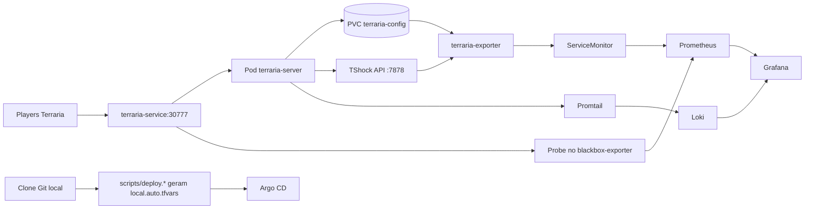

<p align="center">
  <a href="README.md"></a>
  <a href="README.pt-BR.md"></a>
</p>

<p align="center">
  
</p>

<p align="center">
  
  
  
  
  
</p>

# terrariadosbobo

Stack local estilo producao para servidor de Terraria com observabilidade, backup e GitOps.

## Sumario

- [O que este projeto sobe](#o-que-este-projeto-sobe)
- [Arquitetura](#arquitetura)
- [Requisitos](#requisitos)
- [Inicio rapido](#inicio-rapido)
- [URLs de acesso](#urls-de-acesso)
- [Gerenciamento de mundo](#gerenciamento-de-mundo)
- [Observabilidade](#observabilidade)
- [Argo CD](#argo-cd)
- [Estrutura do repositorio](#estrutura-do-repositorio)
- [Troubleshooting](#troubleshooting)
- [Destroy](#destroy)

## O que este projeto sobe

| Camada | Componentes |
|---|---|
| Jogo | `terraria-server` (`ghcr.io/beardedio/terraria:tshock-latest`) + PVC `terraria-config` |
| Metricas | Stack Prometheus Operator (`kube-prometheus-stack`), `kube-state-metrics`, node exporter |
| Metricas de gameplay | `terraria-exporter` custom (API + fallback parser de `.wld`) |
| Disponibilidade | Blackbox exporter + `Probe` TCP do servidor |
| Dashboards | `Terraria K8s Overview` e `Terraria Gameplay Overview` |
| Logs | Loki + Promtail |
| GitOps | Argo CD + Application bootstrap opcional |
| Seguranca de dados | CronJob de backup + PVC de backup |

## Arquitetura



## Requisitos

| Requisito | Observacao |
|---|---|
| Docker Desktop com Kubernetes habilitado | Cluster local no contexto `docker-desktop` |
| `kubectl` | Precisa acessar o cluster |
| `terraform` | Testado com Terraform 1.6+ |
| Git | Usado na deteccao automatica do repo para Argo |
| Windows PowerShell ou Linux/WSL Bash | Ambos suportados |

## Inicio rapido

### 1) Copiar variaveis

```powershell
Copy-Item terraform/terraform.tfvars.example terraform/terraform.tfvars
```

```bash
cp terraform/terraform.tfvars.example terraform/terraform.tfvars
```

Edite pelo menos:

- `world_file`
- `grafana_admin_password`

### 2) Variaveis de ambiente opcionais

`deploy.ps1` e `deploy.sh` podem gerar `terraform/local.auto.tfvars` automaticamente (arquivo ignorado no git), com base no clone atual.

Para repositorio Argo CD (opcional):

- `ARGOCD_APP_REPO_URL`
- `ARGOCD_REPO_USERNAME`
- `ARGOCD_REPO_PASSWORD`
- `ARGOCD_REPO_SSH_PRIVATE_KEY`

Para OAuth GitHub no Grafana (opcional):

- `GRAFANA_GITHUB_OAUTH_ENABLED`
- `GRAFANA_GITHUB_CLIENT_ID`
- `GRAFANA_GITHUB_CLIENT_SECRET`
- `GRAFANA_GITHUB_ALLOWED_ORGS` (separado por virgula)

Exemplo PowerShell:

```powershell
$env:GRAFANA_GITHUB_OAUTH_ENABLED = "true"
$env:GRAFANA_GITHUB_CLIENT_ID = "seu-client-id"
$env:GRAFANA_GITHUB_CLIENT_SECRET = "seu-client-secret"
$env:GRAFANA_GITHUB_ALLOWED_ORGS = "sua-org"
```

### 3) Deploy

Windows:

```powershell
./scripts/deploy.ps1
```

Linux / WSL:

```bash
bash ./scripts/deploy.sh
```

Com bootstrap do primeiro mundo:

```powershell
./scripts/deploy.ps1 -WorldName "test.wld" -WorldSize large -MaxPlayers 16 -Difficulty expert -Seed "seed-123"
```

```bash
bash ./scripts/deploy.sh --world-name test.wld --world-size large --max-players 16 --difficulty expert --seed seed-123
```

## URLs de acesso

| Servico | URL |
|---|---|
| Grafana | `http://localhost:30030` |
| Prometheus | `http://localhost:30090` |
| Argo CD | `http://localhost:30080` |
| Servidor Terraria | `SEU_IP_LAN:30777` |

## Gerenciamento de mundo

Upload de mapa existente:

```powershell
./scripts/upload-world.ps1 -WorldFile "C:/caminho/mapa.wld"
```

```bash
bash ./scripts/upload-world.sh --world-file /c/caminho/mapa.wld
```

Criacao automatica se o mapa nao existir:

```powershell
./scripts/upload-world.ps1 -WorldName "test.wld" -WorldSize medium -MaxPlayers 8 -Difficulty classic -Seed "minha-seed"
```

```bash
bash ./scripts/upload-world.sh --world-name test.wld --world-size medium --max-players 8 --difficulty classic --seed minha-seed
```

Parametros de criacao suportados:

- `WorldSize` / `--world-size`: `small|medium|large`
- `MaxPlayers` / `--max-players`
- `Difficulty` / `--difficulty`: `classic|expert|master|journey`
- `Seed` / `--seed`
- `ServerPort` / `--server-port`
- `ExtraCreateArgs` / `--extra-create-args`

## Observabilidade

### Dashboards nativos

- `Terraria K8s Overview`
- `Terraria Gameplay Overview`

### PromQL util para checagem rapida

```promql
max(terraria_exporter_source_up)
max(terraria_world_parser_up)
max(terraria_players_online)
max(terraria_world_chests_total)
topk(20, sum by (item) (terraria_chest_item_count_by_item))
probe_success{job="terraria-tcp-probe"}
```

## Argo CD

Senha inicial do admin:

```bash
kubectl -n argocd get secret argocd-initial-admin-secret -o jsonpath="{.data.password}" | base64 -d; echo
```

Notas:

- A Application bootstrap so e criada se `argocd_app_repo_url` estiver configurado.
- Os scripts de deploy detectam `remote.origin.url` automaticamente por padrao.

## Estrutura do repositorio

```text
.
|-- argocd/
|   `-- apps/bootstrap/
|-- exporter/
|   `-- exporter.py
|-- scripts/
|   |-- deploy.ps1
|   |-- deploy.sh
|   |-- upload-world.ps1
|   `-- upload-world.sh
`-- terraform/
    |-- main.tf
    |-- addons.tf
    |-- variables.tf
    |-- outputs.tf
    `-- terraform.tfvars.example
```

## Troubleshooting

Cluster nao responde:

```bash
kubectl config use-context docker-desktop
kubectl cluster-info
kubectl get nodes
```

Pod de Terraria em `CrashLoopBackOff` com `World file does not exist`:

```bash
kubectl -n terraria logs deploy/terraria-server --tail=120
bash ./scripts/upload-world.sh --world-name test.wld
kubectl -n terraria get pods
```

Dashboard vazio:

```bash
kubectl -n terraria logs deploy/terraria-exporter --tail=200
kubectl -n monitoring get pods
kubectl -n monitoring get servicemonitors,prometheusrules,probes
```

## Destroy

```bash
terraform -chdir=terraform destroy -auto-approve
```
