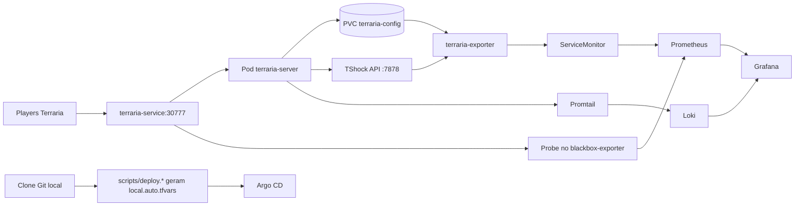

<p align="center">
  <a href="README.md"></a>
  <a href="README.pt-BR.md"></a>
</p>

<p align="center">
  
</p>

<p align="center">
  
</p>

<p align="center">
  
  
  
  
  
</p>

# terrariadosbobo

Stack local estilo producao para servidor de Terraria com observabilidade, backup e GitOps.

## Sumario

- [O que este projeto sobe](#o-que-este-projeto-sobe)
- [Arquitetura](#arquitetura)
- [Requisitos](#requisitos)
- [Inicio rapido](#inicio-rapido)
- [URLs de acesso](#urls-de-acesso)
- [Matriz de comandos cross-platform](#matriz-de-comandos-cross-platform)
- [Screenshots](#screenshots)
- [Gerenciamento de mundo](#gerenciamento-de-mundo)
- [Observabilidade](#observabilidade)
- [Argo CD](#argo-cd)
- [Terraform vs Argo CD](#terraform-vs-argo-cd)
- [Deploy em cloud (AWS, GCP, OCI)](#deploy-em-cloud-aws-gcp-oci)
- [Armazenamento externo de mundo e backups](#armazenamento-externo-de-mundo-e-backups)
- [Estrutura do repositorio](#estrutura-do-repositorio)
- [Troubleshooting](#troubleshooting)
- [Destroy](#destroy)

## O que este projeto sobe

| Camada | Componentes |
|---|---|
| Jogo | `terraria-server` (`ghcr.io/beardedio/terraria:tshock-latest`) + PVC `terraria-config` |
| Metricas | Stack Prometheus Operator (`kube-prometheus-stack`), `kube-state-metrics`, node exporter |
| Metricas de gameplay | `terraria-exporter` custom (API + fallback parser de `.wld`) |
| Disponibilidade | Blackbox exporter + `Probe` TCP do servidor |
| Dashboards | `Terraria K8s Overview`, `Terraria Gameplay Overview`, `Terraria Logs Overview` |
| Logs | Loki + Promtail |
| GitOps | Argo CD + Application bootstrap opcional |
| Seguranca de dados | CronJob de backup + PVC de backup |

## Arquitetura



## Requisitos

| Requisito | Observacao |
|---|---|
| Docker Desktop com Kubernetes habilitado | Cluster local no contexto `docker-desktop` |
| `kubectl` | Precisa acessar o cluster |
| `terraform` | Testado com Terraform 1.6+ |
| Git | Usado na deteccao automatica do repo para Argo |
| Windows PowerShell ou Linux/WSL Bash | Ambos suportados |

## Inicio rapido

### 1) Copiar variaveis

```powershell
Copy-Item terraform/terraform.tfvars.example terraform/terraform.tfvars
```

```bash
cp terraform/terraform.tfvars.example terraform/terraform.tfvars
```

Edite pelo menos:

- `world_file`
- `grafana_admin_password`

### 2) Variaveis de ambiente opcionais

`deploy.ps1` e `deploy.sh` podem gerar `terraform/local.auto.tfvars` automaticamente (arquivo ignorado no git), com base no clone atual.

Para repositorio Argo CD (opcional):

- `ARGOCD_APP_REPO_URL`
- `ARGOCD_REPO_USERNAME`
- `ARGOCD_REPO_PASSWORD`
- `ARGOCD_REPO_SSH_PRIVATE_KEY`

Para OAuth GitHub no Grafana (opcional):

- `GRAFANA_GITHUB_OAUTH_ENABLED`
- `GRAFANA_GITHUB_CLIENT_ID`
- `GRAFANA_GITHUB_CLIENT_SECRET`
- `GRAFANA_GITHUB_ALLOWED_ORGS` (separado por virgula)

Exemplo PowerShell:

```powershell
$env:GRAFANA_GITHUB_OAUTH_ENABLED = "true"
$env:GRAFANA_GITHUB_CLIENT_ID = "seu-client-id"
$env:GRAFANA_GITHUB_CLIENT_SECRET = "seu-client-secret"
$env:GRAFANA_GITHUB_ALLOWED_ORGS = "sua-org"
```

Exemplo Bash:

```bash
export GRAFANA_GITHUB_OAUTH_ENABLED=true
export GRAFANA_GITHUB_CLIENT_ID="seu-client-id"
export GRAFANA_GITHUB_CLIENT_SECRET="seu-client-secret"
export GRAFANA_GITHUB_ALLOWED_ORGS="sua-org"
```

### 3) Deploy

Windows:

```powershell
./scripts/deploy.ps1
```

Linux / WSL:

```bash
bash ./scripts/deploy.sh
```

Com bootstrap do primeiro mundo:

```powershell
./scripts/deploy.ps1 -WorldName "test.wld" -WorldSize large -MaxPlayers 16 -Difficulty expert -Seed "seed-123"
```

```bash
bash ./scripts/deploy.sh --world-name test.wld --world-size large --max-players 16 --difficulty expert --seed seed-123
```

## URLs de acesso

| Servico | URL |
|---|---|
| Grafana | `http://localhost:30030` |
| Prometheus | `http://localhost:30090` |
| Argo CD | `http://localhost:30080` |
| World UI (app Argo) | `http://localhost:30878` |
| Servidor Terraria | `SEU_IP_LAN:30777` |

## Matriz de comandos cross-platform

| Tarefa | Windows (PowerShell) | Linux/WSL (Bash) |
|---|---|---|
| Subir stack | `./scripts/deploy.ps1` | `bash ./scripts/deploy.sh` |
| Subir com bootstrap de mundo | `./scripts/deploy.ps1 -WorldName "test.wld" -WorldSize large -MaxPlayers 16 -Difficulty expert -Seed "seed-123"` | `bash ./scripts/deploy.sh --world-name test.wld --world-size large --max-players 16 --difficulty expert --seed seed-123` |
| Upload de mundo | `./scripts/upload-world.ps1 -WorldFile "C:/caminho/map.wld"` | `bash ./scripts/upload-world.sh --world-file /c/caminho/map.wld` |
| UI de criacao + gerenciamento (local) | `./scripts/world-creator-ui.ps1` | `bash ./scripts/world-creator-ui.sh` |
| UI de criacao + gerenciamento (no cluster) | `./scripts/world-creator-ui.ps1 -K8s` | `bash ./scripts/world-creator-ui.sh --k8s` |
| Criar mundo se nao existir | `./scripts/upload-world.ps1 -WorldName "test.wld"` | `bash ./scripts/upload-world.sh --world-name test.wld` |
| Ver pods | `kubectl get pods -A` | `kubectl get pods -A` |
| Logs do Terraria | `kubectl -n terraria logs deploy/terraria-server --tail=200` | `kubectl -n terraria logs deploy/terraria-server --tail=200` |
| Senha admin ArgoCD | `[Text.Encoding]::UTF8.GetString([Convert]::FromBase64String((kubectl -n argocd get secret argocd-initial-admin-secret -o jsonpath="{.data.password}")))` | `kubectl -n argocd get secret argocd-initial-admin-secret -o jsonpath="{.data.password}" | base64 -d; echo` |
| Destruir stack | `terraform -chdir=terraform destroy -auto-approve` | `terraform -chdir=terraform destroy -auto-approve` |

## Screenshots
> A galeria visual usa arquivos de `docs/screenshots/`. Substitua os placeholders por capturas reais do seu ambiente.

| Grafana K8s | Grafana Gameplay |
|---|---|
|  |  |

| Grafana Logs | Argo CD Applications |
|---|---|
|  |  |

| Argo CD Details |
|---|
|  |

Guia de captura: `docs/screenshots/README.md`

## Gerenciamento de mundo

Console tematico de Terraria para criacao de mundo e gerenciamento do servidor:

```powershell
./scripts/world-creator-ui.ps1
```

```bash
bash ./scripts/world-creator-ui.sh
```

Abra `http://127.0.0.1:8787` e crie mapas visualmente com:

- nome do mundo
- tamanho
- dificuldade
- tipo de evil
- seed manual
- biblioteca de seeds especiais (multi-select)
- maximo de players
- upload de `.wld` (copia para PVC e ativa o mundo automaticamente)
- painel em tempo real (pods, logs, mundo ativo, endpoints)
- acoes rapidas (`start`, `stop`, `restart`, `set active world`)

Rodar a UI dentro do Kubernetes (NodePort `30878`) em vez de processo local:

```powershell
./scripts/world-creator-ui.ps1 -K8s
```

```bash
bash ./scripts/world-creator-ui.sh --k8s
```

Remover UI em-cluster:

```powershell
./scripts/world-creator-ui.ps1 -K8s -K8sDelete
```

```bash
bash ./scripts/world-creator-ui.sh --k8s --k8s-delete
```

Ao selecionar multiplas seeds especiais, a UI resolve para `get fixed boi` (modo Zenith), seguindo o comportamento de combinacao.

Upload de mapa existente:

```powershell
./scripts/upload-world.ps1 -WorldFile "C:/caminho/mapa.wld"
```

```bash
bash ./scripts/upload-world.sh --world-file /c/caminho/mapa.wld
```

Criacao automatica se o mapa nao existir:

```powershell
./scripts/upload-world.ps1 -WorldName "test.wld" -WorldSize medium -MaxPlayers 8 -Difficulty classic -Seed "minha-seed"
```

```bash
bash ./scripts/upload-world.sh --world-name test.wld --world-size medium --max-players 8 --difficulty classic --seed minha-seed
```

Parametros de criacao suportados:

- `WorldSize` / `--world-size`: `small|medium|large`
- `MaxPlayers` / `--max-players`
- `Difficulty` / `--difficulty`: `classic|expert|master|journey`
- `Seed` / `--seed`
- `ServerPort` / `--server-port`
- `ExtraCreateArgs` / `--extra-create-args`

## Observabilidade

### Dashboards nativos

- `Terraria K8s Overview`
- `Terraria Gameplay Overview`
- `Terraria Logs Overview`

O exporter de gameplay agora trabalha com duas fontes:

- Metricas runtime: API/logs (`terraria_exporter_source_up`, `terraria_world_runtime_up`, `terraria_players_online`)
- Metricas snapshot: parser do `.wld` (`terraria_world_*_total`, `terraria_world_snapshot_age_seconds`)

Assim o dashboard nao confunde valor congelado de snapshot com estado ao vivo.

### PromQL util para checagem rapida

```promql
max(terraria_exporter_source_up)
max(terraria_world_parser_up)
max(terraria_players_online)
max(terraria_world_chests_total)
topk(20, sum by (item) (terraria_chest_item_count_by_item))
probe_success{job="terraria-tcp-probe"}
```

### LogQL util para logs (Loki)

```logql
{namespace="terraria"}
{namespace="argocd"}
{namespace=~"terraria|argocd|monitoring"} |= "error"
topk(10, sum by (namespace, pod) (count_over_time({namespace=~"terraria|argocd|monitoring"}[5m])))
```

No Grafana, tambem da para usar o menu `Explore` e selecionar a fonte `Loki`.

## Argo CD

Senha inicial do admin:

```bash
kubectl -n argocd get secret argocd-initial-admin-secret -o jsonpath="{.data.password}" | base64 -d; echo
```

Notas:

- A Application bootstrap so e criada se `argocd_app_repo_url` estiver configurado.
- O bootstrap em `argocd/apps/bootstrap` agora orquestra apps filhas (`kube-prom-stack`, `loki-stack`, `terraria-core`, `monitoring-addons`, `world-ui`).
- Os scripts de deploy detectam `remote.origin.url` automaticamente por padrao.
- Os scripts de deploy tambem sincronizam o codigo da world-ui para `argocd/apps/world-ui/code` antes do `terraform apply`.
- Os scripts de deploy tambem sincronizam `argocd/apps/bootstrap/repo-settings.yaml` para as apps filhas apontarem para o clone do proprio usuario.

Status/operacao Argo:

```bash
kubectl -n argocd get applications
kubectl -n argocd describe application terrariadosbobo-terraria-core
kubectl -n argocd describe application terrariadosbobo-monitoring-addons
```

## Terraform vs Argo CD

Resumo rapido:

- **O cluster Kubernetes continua o mesmo** (no seu caso, `docker-desktop`).
- **O state do Terraform nao vai para o Argo CD**. Argo nao usa state do Terraform.
- Terraform e Argo atuam em camadas diferentes:
  - Terraform: camada de bootstrap/infra (providers, recursos base, definicoes de Helm, wiring de secrets).
  - Argo CD: reconciliacao continua do estado desejado vindo do Git (camada GitOps de apps).

Modelo recomendado neste repositorio hoje:

1. Terraform para bootstrap e evolucao da base.
2. Argo CD para reconciliar continuamente os manifests/apps GitOps.
3. Se quiser modelo estrito "apps so via Argo", migrar em fases (recurso por recurso) e depois remover ownership no Terraform para evitar ownership duplo.

## Deploy em cloud (AWS, GCP, OCI)

Este repositorio pode sair do Docker Desktop local para Kubernetes gerenciado mantendo a mesma camada GitOps (`argocd/apps/*`).

Opcoes alvo:

- AWS: EKS + EBS CSI + (opcional) ingress NLB/ALB
- GCP: GKE + GCE PD CSI + (opcional) ingress GCLB
- OCI: OKE + OCI Block Volume CSI + (opcional) OCI Load Balancer

Separacao recomendada:

1. Terraform cuida da plataforma/infra (cluster, node pools, storage classes, rede, DNS/TLS, bootstrap do Argo CD).
2. Argo CD cuida da camada de apps (Terraria, monitoring add-ons, world UI).

Checklist pratico de migracao:

1. Provisionar cluster gerenciado e validar contexto `kubectl`.
2. Ajustar storage class real no lugar de `hostpath`.
3. Expor services via `LoadBalancer` ou ingress (em vez de NodePort local).
4. Subir Argo CD e sincronizar `argocd/apps/bootstrap`.
5. Validar health no Argo e dashboards no Grafana antes do cutover.

Importante:

- Um recurso deve ter apenas um owner (Terraform ou Argo), nunca os dois ao mesmo tempo.
- Fazer migracao em fases para evitar drift e recriacao repetitiva.

## Armazenamento externo de mundo e backups

Sim, da para manter os mundos fora do cluster e ter backup automatico.

Padrao recomendado (estilo producao):

1. Mundo ativo no PVC (`terraria-config`) para I/O de runtime.
2. Backup agendado do PVC para storage externo:
   - AWS S3, GCS, OCI Object Storage (recomendado)
   - Google Drive com `rclone` (funciona, mas menos ideal para automacao de longo prazo)
3. Fluxo de restore que baixa um mundo escolhido do storage remoto para o PVC antes do startup.

Notas operacionais:

- Para trocar/restaurar mundo, escalar `terraria-server` para `0`, restaurar arquivo e depois voltar para `1`.
- Definir retencao (`N` backups) e criptografia em repouso no storage remoto.
- Expor metrica/alerta de sucesso de backup no Prometheus.

Pacote "subir do zero" (sem ferramentas locais instaladas) tambem e possivel:

1. Provisionamento com cloud-init/Ansible/Terraform para instalar dependencias.
2. Instalar Argo CD e sincronizar este repo automaticamente.
3. Puxar mundo inicial do storage remoto no bootstrap.
4. Manter backup continuo para storage remoto.

Esse modelo deixa o ambiente reproduzivel em maquina/VM nova com minimo de passo manual.

## Estrutura do repositorio

```text
.
|-- argocd/
|   `-- apps/
|       |-- bootstrap/
|       |-- monitoring-addons/
|       |-- terraria-core/
|       `-- world-ui/
|-- exporter/
|   `-- exporter.py
|-- scripts/
|   |-- deploy.ps1
|   |-- deploy.sh
|   |-- upload-world.ps1
|   |-- upload-world.sh
|   |-- world-creator-ui.ps1
|   `-- world-creator-ui.sh
|-- world-ui/
|   |-- server.py
|   `-- static/
`-- terraform/
    |-- main.tf
    |-- addons.tf
    |-- variables.tf
    |-- outputs.tf
    `-- terraform.tfvars.example
```

## Troubleshooting

Cluster nao responde:

```bash
kubectl config use-context docker-desktop
kubectl cluster-info
kubectl get nodes
```

Pod de Terraria em `CrashLoopBackOff` com `World file does not exist`:

```bash
kubectl -n terraria logs deploy/terraria-server --tail=120
bash ./scripts/upload-world.sh --world-name test.wld
kubectl -n terraria get pods
```

Dashboard vazio:

```bash
kubectl -n terraria logs deploy/terraria-exporter --tail=200
kubectl -n monitoring get pods
kubectl -n monitoring get servicemonitors,prometheusrules,probes
```

## Destroy

```bash
terraform -chdir=terraform destroy -auto-approve
```

